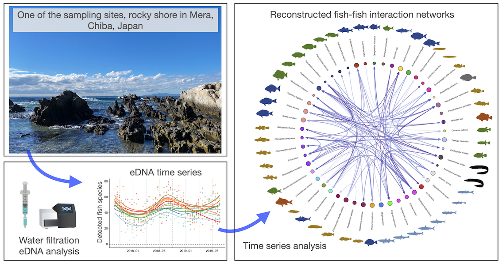

Github repository is here: <https://github.com/ong8181/OCES4103>

# Visualization of high dimensional data: Barplots, PCA and others

## Reference and datasets

-   `vegan` CRAN page (<https://cran.r-project.org/web/packages/vegan/index.html>)
-   `vegan` manual (<https://cran.r-project.org/web/packages/vegan/vegan.pdf>)
-   `ggplot2` (<https://ggplot2.tidyverse.org/>)

# Contents

1.  Barplots for community composition data
2.  Principal Component Analysis (PCA) with `iris`
3.  Principal Component Analysis (PCA) with higher dimensional data
4.  MDS (PCoA) and NMDS

# 1. Barplots for community composition data

Barplots are one of the simplest and common plots to visualize a high-dimensional data. In this section, we will use eDNA data from Ushio et al. (2023) *eLife* to do some exercises to visualize eDNA-based fish community composition data.

## Brief background of the data

In Ushio et al. (2023) *eLife*, water samples were collected twice a month from August 2017 to August 2019 in Chiba Prefecture, Japan. Then, DNA was extracted from water samples, and fish DNA in the samples were analyzed. We have made all data public at [Github](https://github.com/ong8181/eDNA-BosoFish-network) (MIT license; anyone can reanalyze it). The graphical abstract of the study is below:\


I edited the data, and you can first use [this CSV file](https://github.com/ong8181/OCES4103/blob/main/data/eDNA_copy_site_top10.csv). In the CSV file, the first four columns indicate the study sites where we collected water samples (i.e., site name, date, latitude, and longitude). The other columns indicate IDs of 50 most dominant fish species, and each value indicate fish DNA copies / ml seawater (copies = an index of fish DNA concentration). If you are interested in fish taxa and study site information, you can check the [taxa data](https://github.com/ong8181/eDNA-BosoFish-network/blob/main/data/tax_sheet.csv) and [study site data](https://github.com/ong8181/eDNA-BosoFish-network/blob/main/data/sample_sheet.csv) in [another Github repository](https://github.com/ong8181/eDNA-BosoFish-network/).

(Note: the eDNA method used in the study is slightly different from that we are using in the eDNA project. The study "estimated" the eDNA concentration (= xxxx eDNA copies/ml seawater). On the other hand, our eDNA project data does NOT provide eDNA concentration data)

First, let's load the data into your R environment.

```{r}
# Load data
d_top10 <- read.csv("data/eDNA_copy_site_top10.csv", row.names = "id")

# Check data
dim(d_top10)
head(d_top10)
```

Barplots can be created as follows:

Let's create simple barplots using the eDNA concentration information.

```{r, fig.width = 10, fig.height = 8}
# Transpose the data and convert the data.type to "matrix"
d_bar <- t(as.matrix(d_top10[,5:15]))

# Generate barplots v1
barplot(d_bar)
```

```{r, fig.width = 10, fig.height = 8}
# Add rownames information
colnames(d_bar) <- d_top10$site_name

# Generate barplots v2
barplot(d_bar,
        col = c(1:11), xlim = c(0,19),
        legend.text = rownames(d_bar),
        xlab = "Site", ylab = "Fish eDNA concentration (copies / ml)",
        args.legend=list(x = 19, y = 80)
    )
```

If we want to focus on the community composition ("%" data), we can use the following code:

```{r, fig.width = 18, fig.height = 10}
# Calculate percentage data ("relative abundance", or "community composition")
## You can try apply() function
d_comp <- apply(d_bar, 2, function(x) x/sum(x))

## Or you can manually calculate the percentage data using a "for" loop
## Calculate the total eDNA copy/ml seawater
#d_sum <- colSums(d_bar)
## Prepare d_comp object
#d_comp <- d_bar
## Calculate percentage using a for loop
#for (i in 1:11) {
#  d_comp[,i] <- d_bar[,i]/d_sum[i]
#}

# Add sample (site) information as row names
colnames(d_comp) <- d_top10$site_name

# Visualize community composition
barplot(d_comp,
        col = c(1:11), xlim = c(0,17),
        legend.text = rownames(d_comp),
        xlab = "Site", ylab = "Fish eDNA composition",
        args.legend=list(x = 17, y = 1)
    )

```

# 2. Principal Component Analysis (PCA) with `iris`

In this section, we will perform PCA with a relatively simple data, `iris` (data with only four dimensions).

```{r}
# Load data
data(iris)
head(iris)
```

First, we will check the overall data structure.

```{r}
# Visualize overall pattern
pairs(iris[,1:4],  # Select numeric variables only
      col = c("red", "blue", "green")[iris$Species]) # Assign color for each species
```

-   Data standardization and normalizatoin
    -   Standardization\
        $x_{std} = \frac{x - \mu}{\sigma}$
    -   Normalization\
        $x_{norm} = \frac{x - x_{min}}{x_{max} - x_{min}}$

```{r}
# Standardize the data
iris_std1 <- scale(iris$Sepal.Length)
iris_std2 <- scale(iris$Sepal.Width)
iris_std3 <- scale(iris$Petal.Length)
iris_std4 <- scale(iris$Petal.Width)
iris_std <- data.frame(Sepal.Length = iris_std1, Sepal.Width = iris_std2, Petal.Length = iris_std3, Petal.Width = iris_std4)

# Or use apply() function
#iris_std <- apply(iris[,1:4], 2, scale)

# Or Normalize the data using apply() function
#iris_std <- apply(iris[,1:4], 2, function(x) (x - min(x))/(max(x) - min(x)))

# Check data
head(iris_std)
```

```{r}
# Do PCA
iris_pca <- prcomp(iris_std)

## Check results with summary() function
summary(iris_pca)
```

```{r}
# Visualize PCA
biplot(iris_pca)
```

```{r}
# Or use raw data to create a custom plot
plot(iris_pca$x[,"PC1"],
     iris_pca$x[,"PC2"],
     pch = 21,                                     # Mark shape (you can use 1-25)
     bg = c("red", "blue", "green")[iris$Species], # Background color
     xlab = "PC1", ylab = "PC2")
```

```{r}
# Check loading score of each variable
iris_pca
```

Interpretation is that "Sepal.Length" contributed `0.52106591`, `0.37741762`, `-0.71956635`, and `-0.26128628` to PC1, PC2, PC3, and PC4, respectively. "Sepal.Width" contributed `-0.26934744`, `0.92329566`, `0.24438178`, and `0.12350962` to PC1, PC2, PC3, and PC4, respectively.

```{r}
# Perform standardization within prcomp() function
iris_pca2 <- prcomp(iris[,1:4], scale = TRUE)

# Summary
summary(iris_pca2)
```

```{r}
# Visualize
biplot(iris_pca2)
```

# 3. Principal Component Analysis (PCA) with higher dimensional data

Then, let's use larger data and do PCA. As for high dimensional data, let's use fish monitoring data from Ushio et al. (2023) *eLife*.

First, we will load the data to R (if you have not done this above).

```{r}
# Load data
d = read.csv("data/eDNA_copy_site_top.csv", row.names = "id")
head(d)
```

## Do fish community compositions cluster depending on the study sites?

Next, we will briefly check whether the fish community compositions depend on the study sites. PCA (or other dimension reduction techniques) is useful to (intuitively) answer this question.

```{r}
# Select fish data only
d_fish = d[, 5:54]

# Calculate eDNA community composition instead of performing standardization
fish_comp <- t(apply(d_fish, 1, function(x) x/sum(x)))

# Do PCA
fish_pca = prcomp(fish_comp)

# Check content
summary(fish_pca)
```

### Visualize the pattern

Then, let's plot only the first two PC axes. ([`cols4all` package](https://github.com/mtennekes/cols4all) is a great package to choose "cool" colors for visualization)

```{r}
# Load color palette
#install.packages("cols4all", dependencies = TRUE)
#library(cols4all)

# Color palette
#c4a("brewer.paired", 11)

# Color palette
color_code <- c("#A6CEE3", "#1F78B4", "#B2DF8A", "#33A02C",
                "#FB9A99", "#E31A1C", "#FDBF6F", "#FF7F00",
                "#CAB2D6", "#6A3D9A", "#FFFF99")
```

```{r, fig.width = 7, fig.height = 6}
# Use raw data to visualize the pattern
plot(fish_pca$x[,"PC1"],
     fish_pca$x[,"PC2"],
     pch = 21,                                   # Mark shape (you can use 1-25)
     bg = color_code[factor(d$site_name)], # Background color
     xlab = "PC1", ylab = "PC2")

# Add a legend for the colors
legend("bottomright",                        # Position of the legend
       legend = levels(factor(d$site_name)), # Labels for the legend
       pch = 21,                             # Mark shape (you can use 1-25)
       pt.bg = color_code)                   # Background colors for the legend
```

### Creating figures using `ggplot2` package

You can create a better plot if you use `ggplot2` package (in [`tidyverse` package](https://www.tidyverse.org/)).

```{r}
# Load tidyverse
library(tidyverse)

# Create a dataframe for visualization
pca_df <- data.frame(PC1 = fish_pca$x[,"PC1"], PC2 = fish_pca$x[,"PC2"], site_name = d$site_name)

# Create plot
ggplot(pca_df, aes(x = PC1, y = PC2, color = site_name)) + # Create plot space (empty)
     geom_point() # Add scatterplot layer
```

```{r}
# Change color
ggplot(pca_df, aes(x = PC1, y = PC2, color = site_name)) + # Create plot space (empty)
     geom_point() + # Add scatterplot layer
     scale_color_manual(values = color_code)
```

# 3. NMDS

Lastly, we can look at how MDS and NMDS can be implemented using the same fish data. Load `vegan` library to perform MDS and NMDS. If `vegan` is not installed, execute `install.packages("vegan")`.

```{r}
# Load libraries
library(vegan)
```

### NMDS

```{r}
# Set random seed for reproduction
set.seed(1234)

# NMDS
fish_nmds = metaMDS(fish_comp, distance = "bray")
```

```{r}
# Simple visualization
plot(fish_nmds)
```

```{r}
# Get NMDS scores
#scores(fish_nmds)$sites
```

```{r, fig.height=6, fig.width=7}
# Visualize NMDS using basic functions
# Create a dataframe for visualization
nmds_df <- data.frame(Axis1 = scores(fish_nmds)$sites[,1], Axis2 = scores(fish_nmds)$sites[,2], site_name = d$site_name)

# Create plot
plot(nmds_df$Axis1,
     nmds_df$Axis2,
     xlim = c(-1.6, 2),
     pch = 21,                                   # Mark shape (you can use 1-25)
     bg = color_code[factor(nmds_df$site_name)], # Background color
     xlab = "NMDS Axis 1", ylab = "NMDS Axis 2")

# Add a legend for the colors
legend("bottomright",                        # Position of the legend
       legend = levels(factor(nmds_df$site_name)), # Labels for the legend
       pch = 21,                             # Mark shape (you can use 1-25)
       pt.bg = color_code)                   # Background colors for the legend
```

```{r}
# Visualize NMDS using ggplot2
ggplot(nmds_df, aes(x = Axis1, y = Axis2, color = site_name)) + # Create plot space (empty)
     geom_point() +                         # Add scatterplot layer
     scale_color_manual(values = color_code)
```

# Optional contents

#### `ggplot2` method to draw stacked barplots

```{r}
# Load data
d_top10 <- read.csv("data/eDNA_copy_site_top10.csv", row.names = "id")

# Calculate percentage data ("relative abundance", or "community composition")
d_bar <- d_top10[,5:15]
d_comp2 <- as.data.frame(t(apply(d_bar, 1, function(x) x/sum(x))))

# Add sample (site) information as row names
d_comp2$site_name <- d_top10$site_name

# Convert to a longer data format
d_comp_long <- tidyr::pivot_longer(d_comp2, cols = -site_name,
                                   names_to = "fish_species",
                                   values_to = "relative_abundance")

# Generate ggplot2 stacked barplot
ggplot(d_comp_long, aes(y = relative_abundance, x = site_name, fill = fish_species)) +
  geom_bar(stat = "identity") +
  scale_fill_manual(values = color_code) +
  theme(axis.text.x = element_text(angle = 90, vjust = 0.5, hjust = 1))
```

#### MDS (or PCoA)

MDS is another type of multi-dimencional scaling. You can check how it is different from PCA or NMDS in this video (<https://youtu.be/GEn-_dAyYME?si=ci5WMkR2iXWn68Sl>). Here I provode R code to perform MDS.

```{r}
# Load data
d = read.csv("data/eDNA_copy_site_top.csv", row.names = "id")

# Select fish data only
d_fish = d[, 5:54]

# Calculate eDNA community composition instead of performing standardization
fish_comp <- t(apply(d_fish, 1, function(x) x/sum(x)))

# Calculate distance (or dissimilar) matrix
fish_bray <- vegdist(fish_comp, method = "bray")

# MDS
fish_pcoa <- cmdscale(fish_bray, eig = TRUE) # eig = T to get eigenvalues. If you do not need them, you can just remove it.
#fish_pcoa
```

```{r}
# Visualize PCoA
# Create a dataframe for visualization
pcoa_df <- data.frame(Axis1 = fish_pcoa$points[,1], Axis2 = fish_pcoa$points[,2], site_name = d$site_name)

# Create plot
ggplot(pcoa_df, aes(x = Axis1, y = Axis2, color = site_name)) + # Create plot space (empty)
     geom_point() +                         # Add scatterplot layer
     scale_color_manual(values = color_code)
```
